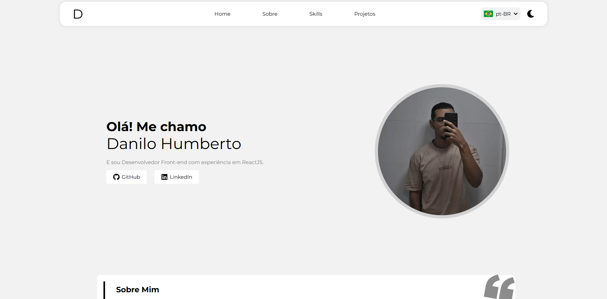

# 💼 Meu Portfólio

Bem-vindo ao meu portfólio! Este projeto apresenta meus trabalhos, habilidades e projetos desenvolvidos.  

🔗 **Acesse o portfólio aqui**: [https://danilo-humberto.github.io/portfolio/](https://danilo-humberto.github.io/portfolio/)  

## 📸 Demonstração

 

## 🚀 Tecnologias Utilizadas

- ⚛️ React  
- 🎨 CSS Puro  
- 🌍 i18n (Internacionalização)  
- 🔆🌙 Dark Mode / Bright Mode  
- 📱 Responsivo para diferentes dispositivos

## 🛠 Como Rodar Localmente

Para rodar o projeto na sua máquina, siga os passos abaixo:

```sh
# Clone o repositório
git clone https://github.com/danilo-humberto/portfolio.git

# Acesse a pasta do projeto
cd portfolio

# Instale as dependências
npm install

# Inicie o servidor local
npm run dev
```

## 📩 Contato

- 📧 Email: danilohumberto12@hotmail.com
- 💼 LinkedIn: [Danilo Humberto](https://www.linkedin.com/in/danilo-humberto-28a771215/)